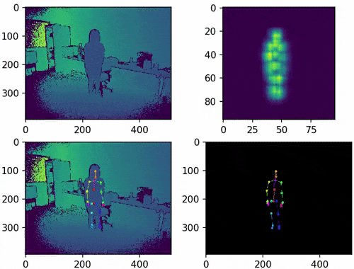

# 30 FPS Body Pose Estimation on mobile using a spatiotemporal CNN-based model on RGB and depth (ToF) images

This is a preview of the results (description of the architectures + code are coming soon). The footages come from the NTU RGB+D Action Recognition Dataset [1].

(The gifs link to a video of better quality)

#### ConvLSTM model on RGB

#### ConvGRU model on depth

### References

[1] Shahroudy, A., Liu, J., Ng, T.-T., & Wang, G. (2016). NTU RGB+D: A Large Scale Dataset for 3D Human Activity Analysis. In The IEEE Conference on Computer Vision and Pattern Recognition (CVPR).